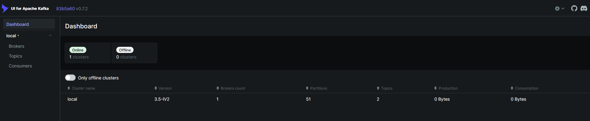

# Real-Time Data Streaming Pipeline

A production-ready real-time data streaming pipeline using Apache Kafka, Python, and PostgreSQL.



## Architecture

```
Data Sources → Kafka Producer → Kafka Broker → Kafka Consumer → Data Processing → PostgreSQL/Analytics
```

## Features

- **Multi-source data ingestion**: API polling, file monitoring, sensor simulation
- **Apache Kafka**: Message broker for reliable stream processing
- **Stream processing**: Real-time data transformation and aggregation
- **Storage**: PostgreSQL for structured data, InfluxDB for time-series
- **Monitoring**: Prometheus metrics and Grafana dashboards
- **Containerized**: Docker Compose for easy deployment

## Project Structure

```
realtime-streaming-pipeline/
├── producers/          # Data producers
├── consumers/          # Data consumers and processors
├── config/            # Configuration files
├── docker/            # Docker configurations
├── monitoring/        # Monitoring and alerting
├── tests/            # Unit and integration tests
└── utils/            # Shared utilities
```

## Quick Start

### Prerequisites
- Docker & Docker Compose
- Python 3.9+
- [uv](https://github.com/astral-sh/uv) - Fast Python package installer
- Make (optional)

### Setup

1. **Clone and navigate to the project**
```bash
cd realtime-streaming-pipeline
```

2. **Install uv (if not already installed)**
```bash
# Linux/WSL/macOS
curl -LsSf https://astral.sh/uv/install.sh | sh

# Or via pip
pip install uv
```

3. **Start the infrastructure**
```bash
docker-compose up -d
```

This will start:
- Zookeeper (port 2181)
- Kafka (port 9092)
- PostgreSQL (port 5432)
- InfluxDB (port 8086)
- Grafana (port 3000)

4. **Install Python dependencies**
```bash
uv sync
```

5. **Run the producer**
```bash
uv run python producers/sensor_producer.py
```

6. **Run the consumer**
```bash
uv run python consumers/analytics_consumer.py
```

## Use Cases

### 1. IoT Sensor Data Pipeline
Simulate IoT sensors sending temperature, humidity, and pressure data for real-time monitoring.

### 2. E-commerce Events
Track user events (clicks, purchases, cart additions) for real-time analytics.

### 3. Financial Transactions
Process financial transactions with fraud detection and anomaly detection.

### 4. Social Media Feed
Aggregate and process social media posts in real-time.

## Configuration

Edit `config/config.yaml` to customize:
- Kafka broker settings
- Database connections
- Producer/consumer parameters
- Processing logic

## Monitoring

Access Grafana at `http://localhost:3000` (admin/admin) to view:
- Message throughput
- Processing latency
- Consumer lag
- System metrics

## Testing

```bash
# Run all tests
uv run pytest tests/

# Run with coverage
uv run pytest --cov=. tests/

# Or use make
make test
```

## Advanced Features

- **Exactly-once semantics**: Kafka transactions for data consistency
- **Schema Registry**: Avro schema management
- **Stream joins**: Combine multiple data streams
- **Windowing**: Time-based aggregations
- **State management**: Stateful stream processing

## Production Considerations

- Enable SSL/TLS for Kafka
- Set up authentication (SASL)
- Configure retention policies
- Implement dead letter queues
- Add alerting for critical metrics
- Scale consumers with consumer groups

## License

MIT
